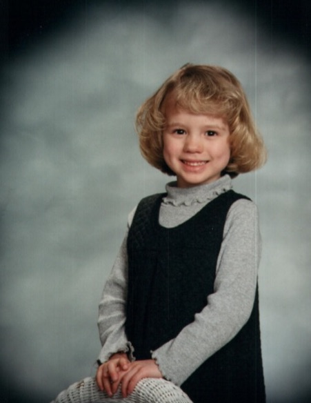
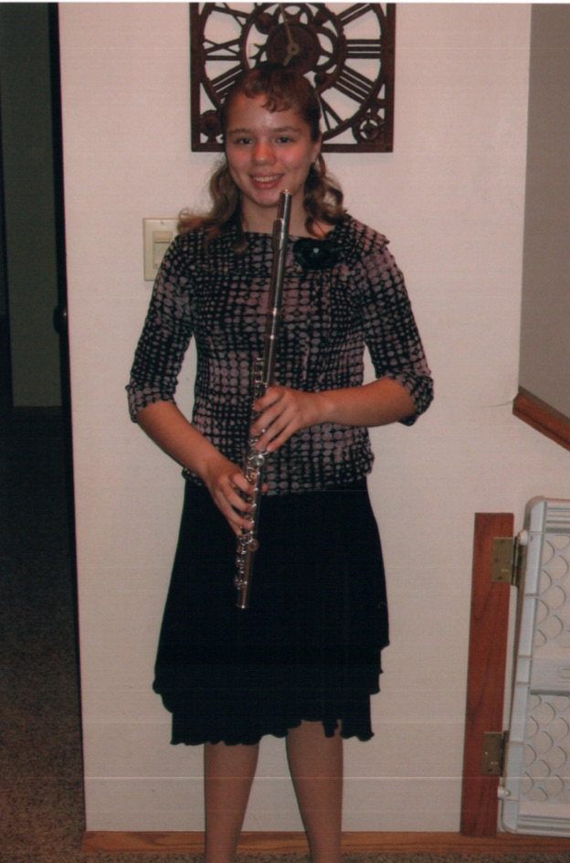
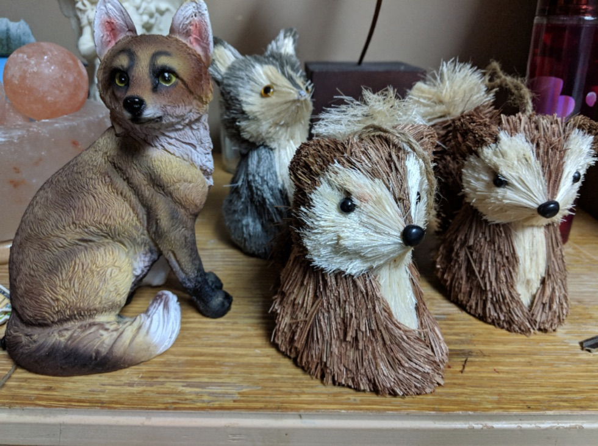
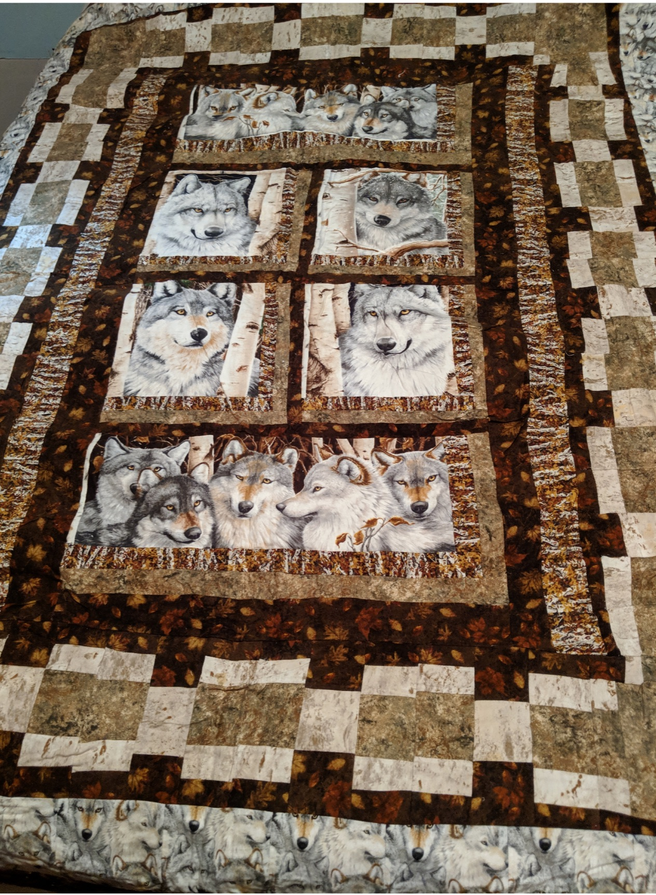

<!DOCTYPE html>
<html lang="en">

    <head>
  <title>Allie De Smit</title>
    <link href="https://fonts.googleapis.com/css?family=Oswald:300,400" rel="stylesheet">
    <meta charset="utf-8"/>
    <meta name="description" content="Allie De Smit">
    <meta name="robots" content="nofollow" />
    <meta name="author" content="Faye Van Roekel">
    <meta name="viewport" content="width=device-width, initial-scale=2.0">
    <link rel="stylesheet" href="stylesheet.css" style="stylesheet/css">
    <link href="https://fonts.googleapis.com/css?family=Oswald:300,500,700/Quattrocento:400,700" rel="stylesheet">  
</head>

<body>

    <header>
    
    
    <h1>Allie Michelle</h1>
    </header>
    
<section class="courses">
    <article>
    

    <hgroup>
        <h2>About Allie</h2>
    </hgroup>
        
Allie De Smit is 22 years old.  Allie was adopted when she was 4 years old. She is a hard worker, a daughter, a sister, a Christian, and a friend.  Allie is a fascinating person with a lot of varied interests!  Some of her interests include: fox, wolves, quilting, Anime and Marvel character movie series.  Allie works at Casey's General Store. Allie has worked at Casey's for almost 2 years. She is able to work in the kitchen, making subs and pizzas, and she is also able to be a main cashier.  Recently Allie applied to be one of the Assistant Managers! Hopefully this is something that will work out for her - it would give her more varied experiences. Allie loves flowers and gardening.  She really enjoys taking care of them and watching them fill out and grow. Allie LOVES to read!  She has read countless numbers of books.  Some of her favorite authors is Laurel K. Hamilton but she enjoys reading many other things as well.

    </article>

<section class="courses">
    <article>
    <hgroup>
        <h2>Musical Talent!</h2>
    </hgroup>
        
 Allie loves listening to music and is very eclectic.  Allie mostly likes listening to Rock, Pop, Country and Christian Rock. The only music she really doesn't enjoy is Opera, Rap and Heavy Metal.  She enjoys the relaxing piano music by Peder B. Hellend when she falls asleep at night.  Allie will most often be found with headphones in her ears!  She will usually be wearing them while she vaccuums and house cleans.  She will even wear them in the grocery store while sheis shopping for groceries.  Allie says that music tends to soothe and relax her.  She is also very musically talented.  She learned to play the flute when she was in 5th grade and the piano when she was in 2nd grade.  Allie continued playing piano until her sophomore year of high school and she played the flute through her senior year. 

     </article>
     
<section class="courses">   
    <article>  
     
    <hgroup>
        <h2>Collections!</h2>
    </hgroup>
        
One of Allie's favorite animals is the fox.  She enjoys watching YouTube channels about people who have fox for pets.  She likes their personalities and the way they are so limber and quick!  She often likes to think about how fun and challenging it would be to have a fox as a house pet!! 

    </article>
     
     
     
     
 <section class="courses">   
    <article>
    <hgroup>
        <h2>Quilting</h2>
    </hgroup>
        
Allie received money when she graduated from high school.  She decided she wanted to use some of her graduation money to purchase material and fabric to make a quilt that was 'wolf' themed.  Allie enjoys watching wolves and seeing them in their habitat.  She is making a quilt with wolves as the theme.  She has done a beautiful job making the quilt!   By making this quilt she will always be able to enjoy and remember that she bought it with her money from high school graduation.  She can also be proud of her efforts in making itl!  

    </article>
    

<section class="courses">
    <figure>
        
        <figcaption>Allie De Smit - 4  1/2 years old.</figcaption>
    </figure>
     
     
     
     
<section class="courses">
     
     
    <figure>
        
        <figcaption>Allie in Junior High Band.</figcaption>
    </figure>
     
     
          
     
     
     
     
     <section class="courses">
     <figure>
        
        <figcaption>Some items from Allie's Fox Collection</figcaption>
     
     
        
        <figcaption>Quilt that Allie made with Wolves</figcaption>
    </figure>

 
        
<aside>
    <section class="Favorite Flowers">
     
        <h2>Favorite Flowers</h2>
    <ul>
        <li>Purple Iris</li>
        <li>Bleeding Heart Bushes</li>
        <li>Sunstar Flowers</li>
        <li>Rose Bushes</li>
        <li>Tiger Lilies</li>
    </ul>
    </section>
</aside>
    
<aside>
    <section class="Reading List">
        <h2>Reading List</h2>
    <ol>
        <li>The Lunatic Cafe</li>
        <li>Circus of the Damned</li>
        <li>Obsidian Butterfly</li>
        <li>Incubus Dreams</li>
        <li>Hit List</li>
    </ol>
    </section>
</aside>
  
<aside>  
    <section class="contact-details">
        <h2>Contact Information</h2>
    
Allie De Smit 
          Midwestern Girl 
          USA 
          silvermustang06@gmail.com

    </section>
</aside>

<footer>
    
Allie M De Smit Webpage Created by Faye Van Roekel

</footer>

</body>
</html>
